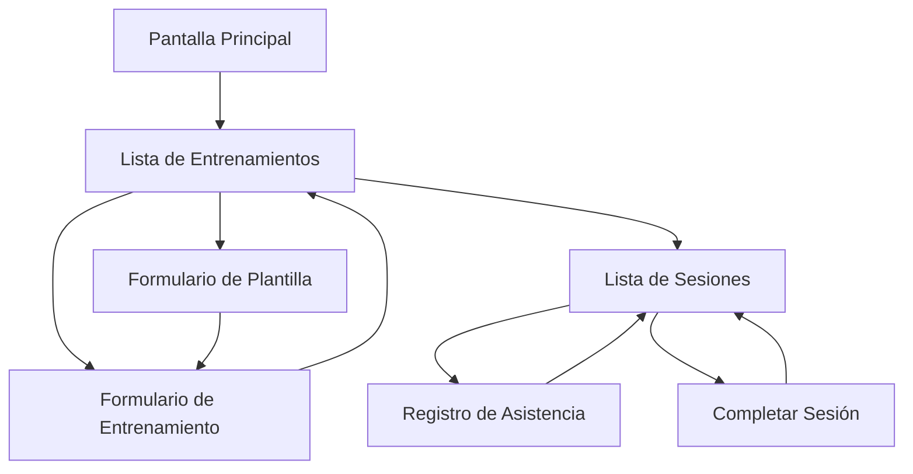
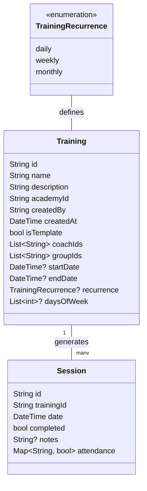
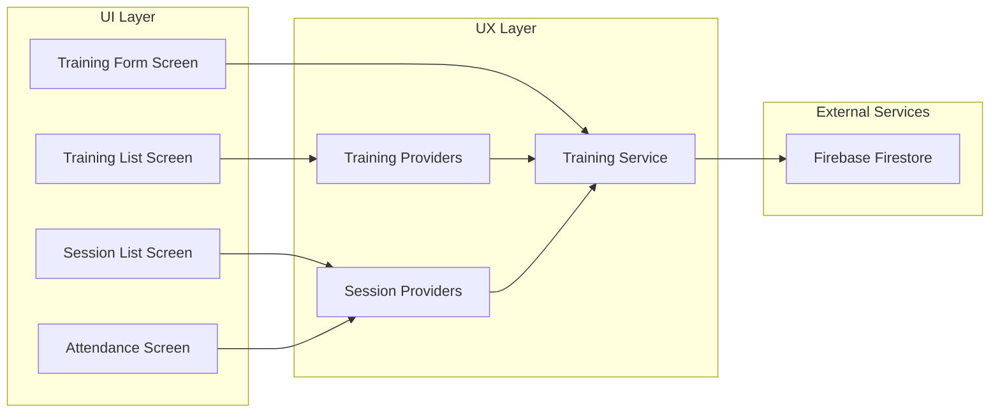
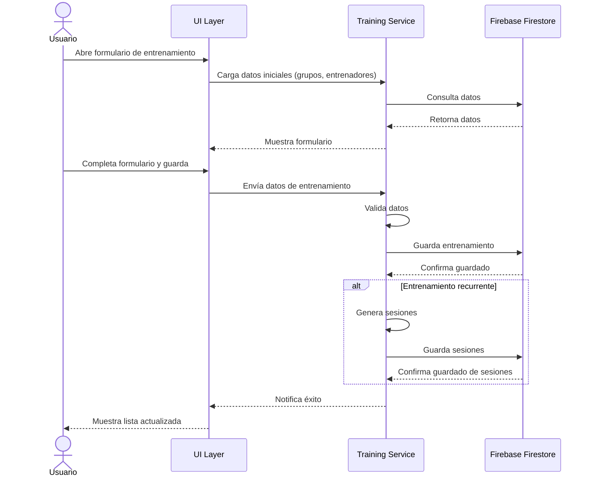
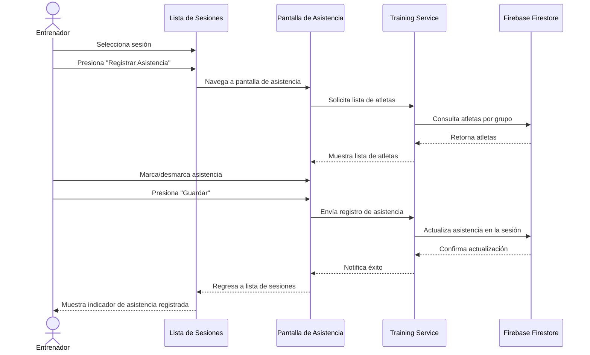
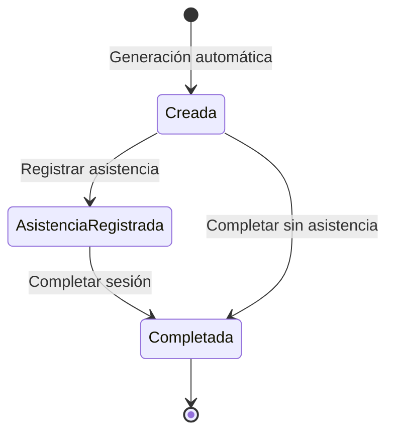

# Diagramas del Sistema de Entrenamientos

Este documento presenta diagramas para visualizar la estructura y flujos del Sistema de Entrenamientos de Arcinus.

## Diagrama de Flujo de Navegación

## Diagrama de Modelo de Datos

## Diagrama de Componentes del Sistema

## Diagrama de Secuencia: Creación de Entrenamiento

## Diagrama de Secuencia: Registro de Asistencia

## Diagrama de Estados: Sesión de Entrenamiento

